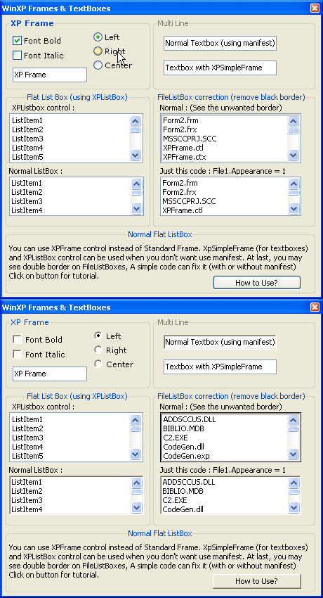



## Xp Frames \- XP Listbox,textbox,filelistbox \(updated\! ver3\)

### Description

Xp Frame,you can use it in 98/Me/XP. You can make your textboxes and listboxes to seems like XP textboxes and listboxes.

Now I fixed the crashing. And also a fixture code for FileListBox. just look at the screenshot
 
### More Info
 

             |
---                |---
**Submitted On**   |2003-07-02 17:31:18
**By**             |[ali s](https://github.com/Planet-Source-Code/PSCIndex/blob/master/ByAuthor/ali-s.md)
**Level**          |Intermediate
**User Rating**    |4.5 (18 globes from 4 users)
**Compatibility**  |VB 6\.0
**Category**       |[Custom Controls/ Forms/  Menus](https://github.com/Planet-Source-Code/PSCIndex/blob/master/ByCategory/custom-controls-forms-menus__1-4.md)
**World**          |[Visual Basic](https://github.com/Planet-Source-Code/PSCIndex/blob/master/ByWorld/visual-basic.md)
**Archive File**   |[Xp\_Frames\_160911732003\.zip](https://github.com/Planet-Source-Code/ali-s-xp-frames-xp-listbox-textbox-filelistbox-updated-ver3__1-46611/archive/master.zip)

